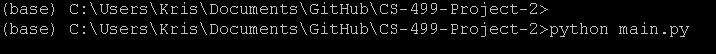
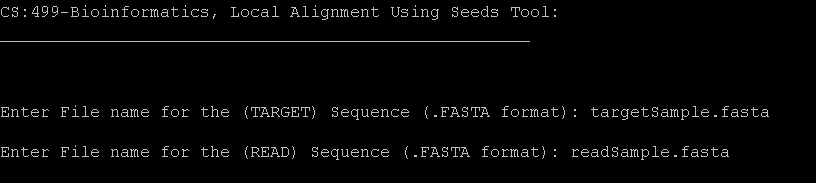
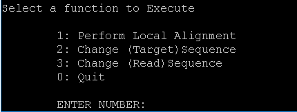
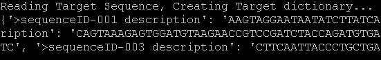
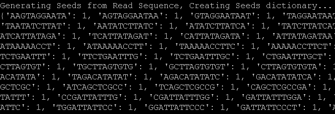

# CS-499: BIOINFORMATICS -- Local Alignment Using Seeds

This tool was built as a project for NAU's Bioinformatics course in the Spring of 2019. It utilizes given target and read sequences to perform a local alignment. Specifically by exact matching k-mers along a read as the seeds then extending those along the target sequence

## Installation
--Install Python 3 or higher; https://www.python.org/download/releases/3.0/

--Clone Repository onto your terminal.

--Run with "python main.py"

## Usage
-On execution, you will be prompted to enter your Target Sequence (the Reference sequence you want to align to) and a Read Sequence (the Sequence you want to be aligned).

-Following that information, you will be brought to a small User Interface which allows for 4 choices, select one to continue or select to end the program.

-Upon Local Alignment various intermediate steps will be performed and you will be notified when they complete. Depending on the size of your Fasta files this could take some time!

## Documentation
Google Document:
- https://docs.google.com/document/d/1H1M-8eIqp5qXSI-awVras7IwrL8CzIw7B8y7r-w9bfE/edit?usp=sharing

Presentation Slides: 
- https://docs.google.com/presentation/d/1iaiGShclBe_xWdfa_mUoTZepvsthqERssWhHPftNayw/edit?usp=sharing

## License
MIT License

Copyright (c) [2019] [NAU]

Permission is hereby granted, free of charge, to any person obtaining a copy
of this software and associated documentation files (the "Software"), to deal
in the Software without restriction, including without limitation the rights
to use, copy, modify, merge, publish, distribute, sublicense, and/or sell
copies of the Software, and to permit persons to whom the Software is
furnished to do so, subject to the following conditions:

The above copyright notice and this permission notice shall be included in all
copies or substantial portions of the Software.

THE SOFTWARE IS PROVIDED "AS IS", WITHOUT WARRANTY OF ANY KIND, EXPRESS OR
IMPLIED, INCLUDING BUT NOT LIMITED TO THE WARRANTIES OF MERCHANTABILITY,
FITNESS FOR A PARTICULAR PURPOSE AND NONINFRINGEMENT. IN NO EVENT SHALL THE
AUTHORS OR COPYRIGHT HOLDERS BE LIABLE FOR ANY CLAIM, DAMAGES OR OTHER
LIABILITY, WHETHER IN AN ACTION OF CONTRACT, TORT OR OTHERWISE, ARISING FROM,
OUT OF OR IN CONNECTION WITH THE SOFTWARE OR THE USE OR OTHER DEALINGS IN THE
SOFTWARE.
